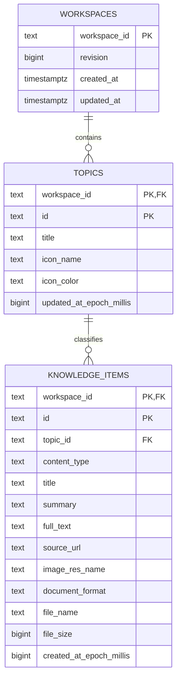

# ArchiveAssistant 数据库设计与云端存储实施报告

报告日期：2026-09-20
数据库 schema：`archive_assistant`

## 1. 实施结果

本次已将 Android 应用当前保存在本地 DataStore 的核心业务数据映射到独立 PostgreSQL
schema，并保留原有本地存储作为默认模式。已提供带鉴权的云端快照 API、Android 云端数据源
实现、运行时数据源选择器、可重复执行的迁移 SQL、显式回滚 SQL和部署说明。

AI 引擎设置、模型路径和 API 密钥仍只保存在设备侧，不进入业务数据库，避免将设备私密配置
误同步到云端。

## 2. 数据边界与映射

| Android 模型 | PostgreSQL 表 | 说明 |
| --- | --- | --- |
| `Topic` | `archive_assistant.topics` | 主题/六部目录元数据 |
| `KnowledgeItem` | `archive_assistant.knowledge_items` | 网页、图像、文档归档条目 |
| 云端工作区 | `archive_assistant.workspaces` | 隔离不同客户端或账号，并维护快照版本 |
| `AiEngineSettings` | 不入库 | 含 API 密钥、模型和设备配置，继续本地保存 |

关系如下：

## 3. 约束与索引设计

- 所有业务主键均保留应用现有字符串 ID，避免本地与云端之间二次映射。
- `workspace_id` 使用复合主键/外键隔离数据，删除工作区时级联清理其主题和条目。
- 条目必须引用同一工作区内已存在的主题；删除主题会删除其条目，避免孤儿数据。
- `content_type` 和 `document_format` 使用 CHECK 约束，与 Kotlin 枚举取值一致。
- 文件大小、毫秒时间戳、修订号均禁止负数；图标颜色校验十六进制格式。
- `(workspace_id, created_at_epoch_millis DESC)` 支持时间线读取；
  `(workspace_id, topic_id)` 支持按主题筛选。
- `revision` 在每次成功替换快照后单调递增，可用于审计和后续乐观并发扩展。

## 4. API 与一致性

| 方法 | 路径 | 行为 |
| --- | --- | --- |
| `GET` | `/health` | 数据库连通性检查 |
| `GET` | `/v1/workspaces/{workspace_id}/snapshot` | 读取完整主题与条目快照 |
| `PUT` | `/v1/workspaces/{workspace_id}/snapshot` | 在单个事务内替换完整快照 |

`/v1` 接口要求 `Authorization: Bearer <ARCHIVE_API_KEY>`。服务端只持有 PostgreSQL
凭据，Android 客户端不会直连数据库。`PUT` 会先校验 ID 唯一性和主题引用，再在事务中写入，
因此并发读取不会看到半写入状态。当前冲突策略为后写覆盖；版本号已保留，可在多用户编辑场景中
进一步加入 `If-Match` 乐观锁。

## 5. 本地/云端兼容方式

- `AppDataSource` 是统一读写契约。
- `AppDataRepository` 保持原 DataStore JSON 行为，默认启用，原数据不会被删除或迁移。
- `CloudAppDataRepository` 使用同一 JSON 字段定义访问云端快照 API。
- `SwitchableAppDataSource.switchTo(...)` 可在 `LOCAL` 与 `CLOUD` 间切换；切换只影响后续读写，
  不清除未选中数据源。
- 应用构建时可通过 `ARCHIVE_DATA_BACKEND`、`ARCHIVE_CLOUD_BASE_URL`、
  `ARCHIVE_CLOUD_WORKSPACE_ID`、`ARCHIVE_CLOUD_API_KEY` 选择初始数据源。配置不完整时安全回退到本地。

## 6. 迁移与部署文件

- `server/sql/001_create_archive_assistant_schema.sql`：幂等建库迁移。
- `server/sql/001_drop_archive_assistant_schema.sql`：显式破坏性回滚。
- `server/migrate.sh`：加载 `server/.env` 并执行迁移；兼容 `DB_*` 和旧 `POSTGRES_*` 变量名。
- `server/app.py`：FastAPI + psycopg 连接池服务。
- `server/requirements.txt`：锁定服务端依赖。
- `server/.env.example`：无密钥配置样例。
- `server/README.md`：部署、接口和 Android 切换说明。

## 7. 已完成验证

- 使用更新后的 `server/.env` 成功连接 PostgreSQL。
- 迁移执行成功，并确认 schema 内三张表、主键和两个业务索引均存在。
- 真实启动 API，验证 `/health` 返回成功。
- 验证无 bearer key 的云端读取返回 HTTP 401。
- 在独立测试工作区执行完整快照 PUT/GET，字段和 `revision=1` 正确回读。
- 端到端测试数据已删除，数据库未残留测试工作区。
- Android 新增的数据源切换测试与相关定向测试全部通过。
- 全量 JVM 测试共 282 项；两次运行各出现 1 个不同的既有异步时序用例超时（均位于未修改的
  `ArchiveAssistantStateStoreTest.waitUntil`），对应失败用例单独重跑均通过，未发现本次改动回归。

## 8. 运维与安全建议

1. 部署 API 时必须设置高强度 `ARCHIVE_API_KEY`，并在网关终止 HTTPS。
2. 公网或多用户产品应使用账号体系签发短期 token，不应长期在公开 APK 中嵌入共享密钥。
3. 定期备份 `archive_assistant` schema，并在恢复演练中检查复合外键和快照版本。
4. 多端同时编辑前建议基于现有 `revision` 增加 `If-Match`，明确处理写冲突。
5. 本地切云端首次同步应由产品层明确选择“上传本地”或“下载云端”，避免隐式覆盖。

## 9. Android CLI 真机链路验证（2026-09-20）

- 向 `android-cli-e2e` 工作区注入 6 个主题和 2 条确定性测试数据。
- 使用 Android CLI 启动 `medium_phone` AVD，并通过 `android run` 安装云端配置 Debug APK。
- App 经 server 成功执行快照 GET 和 PUT，服务端响应均为 HTTP 200。
- Android 布局树确认进入“工 · 营造”并定位“云端联调验证文档”。
- 逐张视觉检查截图，奏章正文清楚显示“来自 PostgreSQL 的 Android CLI 端到端测试数据”。
- 数据库回查修订号由 1 增至 6，测试条目仍存在，证明读取、合并与写回均已落库。
- 详细步骤见 `test-artifacts/android-cli-server-journey-results.md`；截图目录已加入 `.gitignore`。
